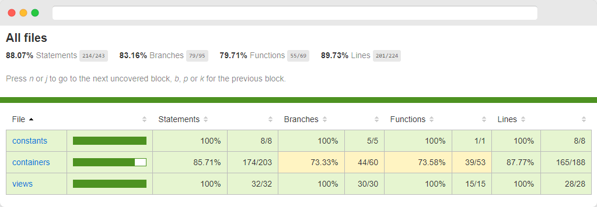
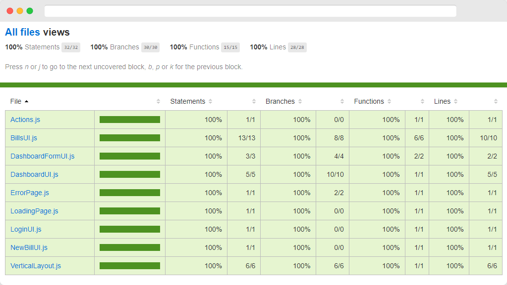
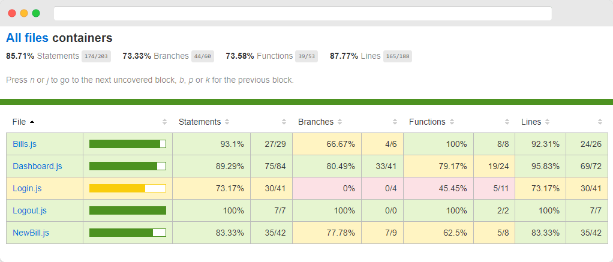

# Billed

## Overview

The objective of this project was to fix a series of bugs (listed [here](https://github.com/alexperronnet/openclassrooms-p9-billed/issues?q=is%3Aissue+is%3Aclosed)), to improve the test coverage and to realize an End-to-End test case.

I usually push projects to the max but to be honest this project was not interesting at all for a multitude of reasons so I preferred to do only what was asked so I could quickly move on.

### Why didn't I like this project?

- The project was not well documented
- The project was not well structured
- The project use a lot of deprecated packages
- The project use bootstrap and jQuery 🤢
- The UI is not responsive
- The UI is not accessible
- I think that write tests for code built by someone else is a waste of time.
- I think that write tests after building a project is not a good practice.
- I prefer to write tests for code that I wrote myself, especially if the project was to learn testing.

## Local Setup

> U can find the original front [here](https://github.com/OpenClassrooms-Student-Center/Billed-app-FR-Front) & back [here](https://github.com/OpenClassrooms-Student-Center/Billed-app-FR-back)

### Clone the repository

```bash
git clone https://github.com/alexperronnet/openclassrooms-p9-billed
```

### Navigate to the project folder

```bash
cd openclassrooms-p7-les-petits-plats/billed-front
```

```bash
cd openclassrooms-p7-les-petits-plats/billed-back
```

### Install dependencies

```bash
npm install
```

> You need to install the dependencies for both the front and the back

### Run the back

```bash
npm run run:dev
```

### Run the front

```bash
live-server
```

> You need to install liver-server globally with `npm install -g liver-server` and go to `http://127.0.0.1:8080/`

## Tests

### Run all tests

```bash
npm run test
```

### Run a single test

```bash
jest <path-to-test-file>
```

## Coverage

### All files



### Views



### Containers



## License

This is an OpenClassrooms project. The code is freely reusable, but assets (images, videos and logo) are not because they are not mine.

If you are also a student of OC, you can freely use my work as inspiration, but I advise you not to copy parts of it.
